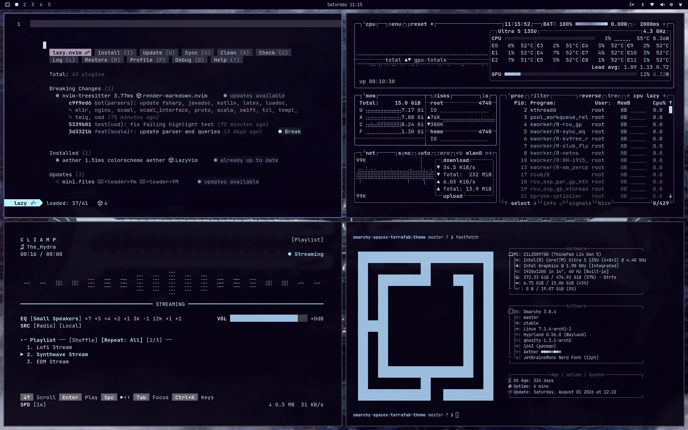
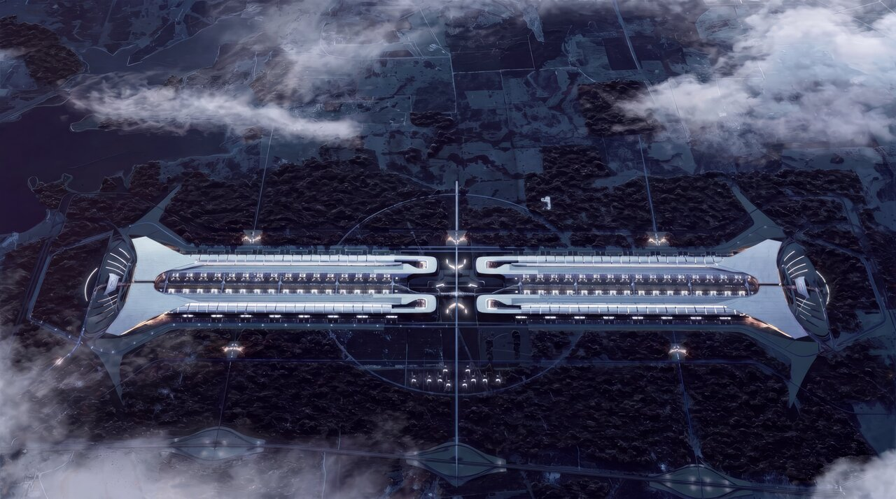
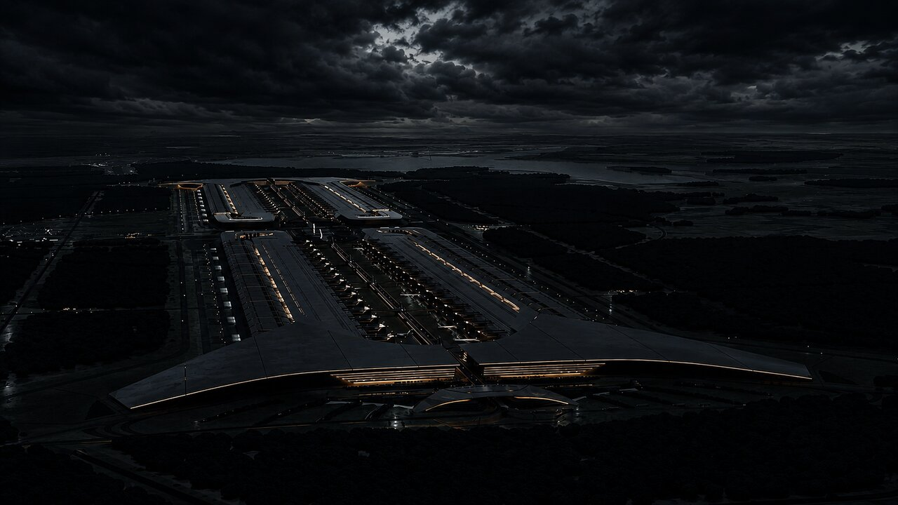
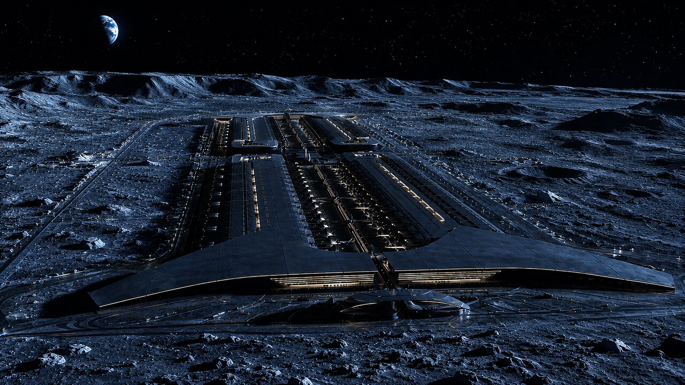
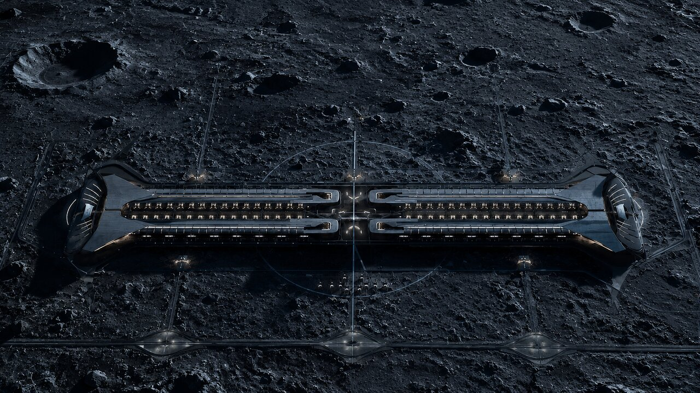
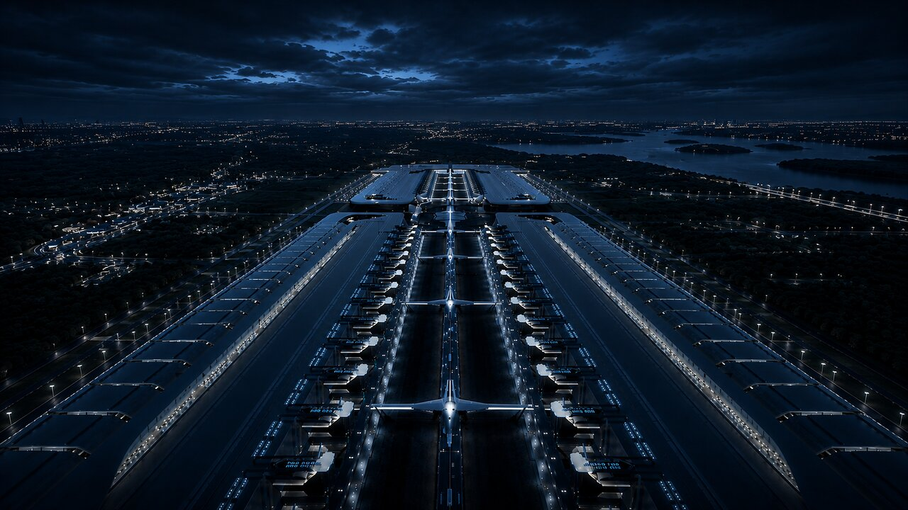
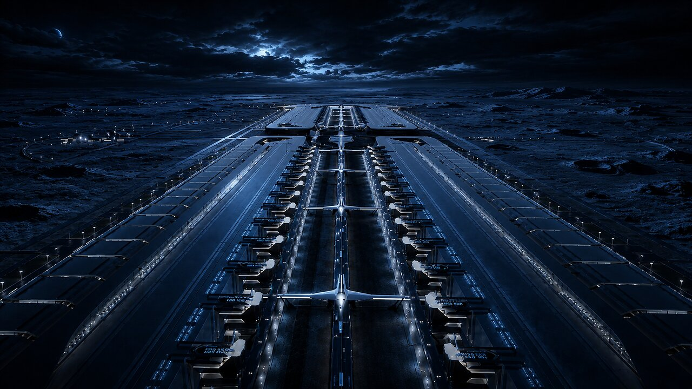
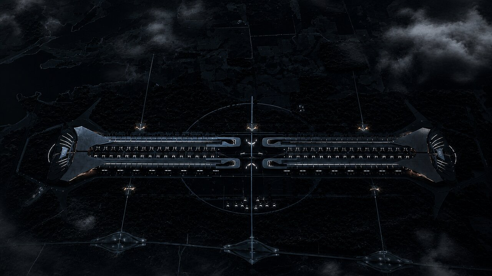
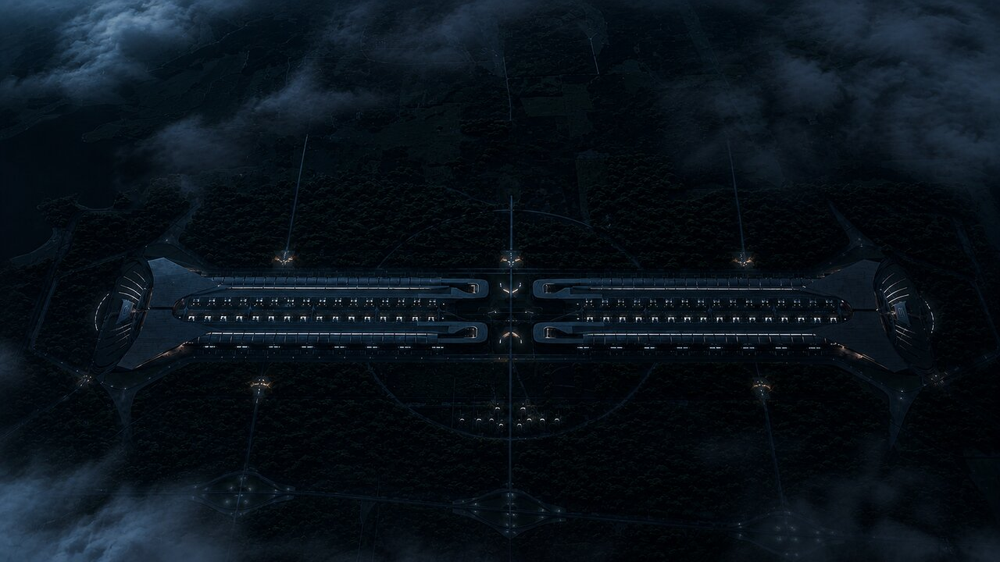
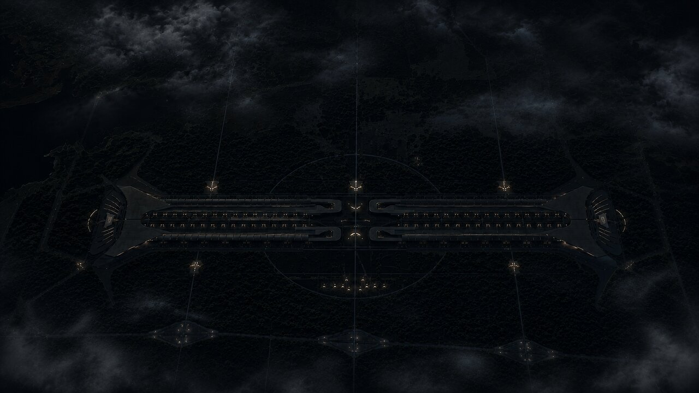

# omarchy-spacex-terrafab-theme



An Omarchy theme based on the SpaceX Terrafab: near-black violet as background, light blue-grey as foreground, with cool accents in ice blue, cyan and lilac.

## Screenshots

Click a thumbnail to open the wallpaper in full resolution.

### Terrafab

[](backgrounds/terrafab.jpeg)

### Terrafab Storm

[](backgrounds/terrafab_storm.png)

### Terrafab Moon

[](backgrounds/terrafab_moon.png)

### Terrafab Moon Crater

[](backgrounds/terrafab_moon_crater.png)

### Terrafab Closeup Earth

[](backgrounds/terrafab_closeup_earth.png)

### Terrafab Closeup Barren

[](backgrounds/terrafab_closeup_barren.png)

### Mysterious Spaceport

[](backgrounds/mysterious_spaceport.png)

### Spaceport Dark

[](backgrounds/spaceport_dark.png)

### Spaceport Darker

[](backgrounds/spaceport_darker.png)

## Installation

```bash
omarchy theme install https://github.com/alexzeitler/omarchy-spacex-terrafab-theme
```
